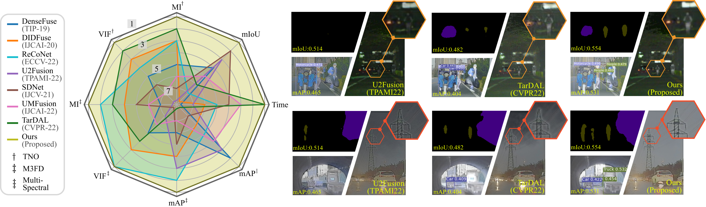
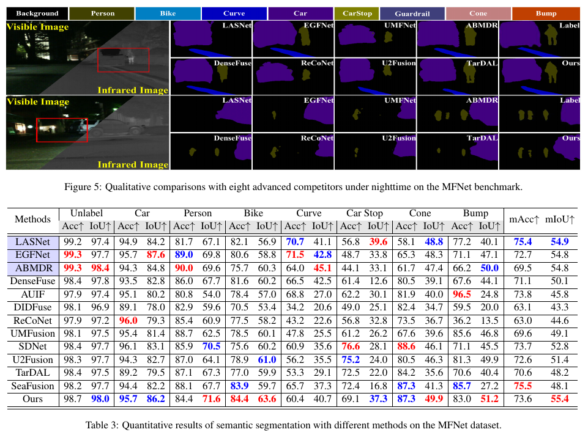

# BDLFusion
 Codes of Bi-level Dynamic Learning  for Jointly Multi-modality Image Fusion and Beyond


Zhu Liu,
Jinyuan Liu,
Guanyao Wu,
Long Ma,
Xin Fan,
Risheng Liu. 
In IJCAI 2023. 
[Paper](https://arxiv.org/pdf/2305.06720.pdf)


## Requirements
+ Python 3.7
+ PyTorch 1.10.1
+ Checkpoint of detection 
[Checkpoint](https://drive.google.com/file/d/1jZgtcS9dxm4fCDutFk_zPqaeZuDlJa5C/view?usp=share_link)

## Usage
### Data preparation
Details will be provided as soon as possible.
### Testing
Run "**python test.py**" to test the model.


### Training

### Workflow

 

### Results of detection
 

### Results of segmentation
 

## Citation
If you use this code for your research, please cite our paper.

```
@article{liu2023bilevel,
  title=Bi-level Dynamic Learning  for Jointly Multi-modality Image Fusion and Beyond},
  author={Zhu Liu and Jinyuan Liu and Guanyao Wu and Long Ma and Xin Fan and Risheng Liu},
  journal={IJCAI},
  year={2023},
}
```


