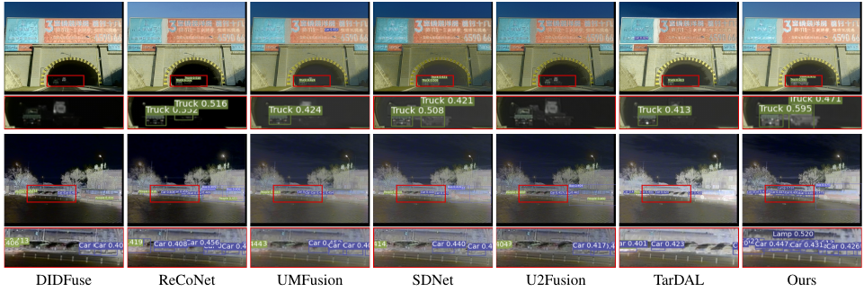

# BDLFusion
 Codes of Bi-level Dynamic Learning  for Jointly Multi-modality Image Fusion and Beyond


Zhu Liu,
Jinyuan Liu,
Guanyao Wu,
Long Ma,
Xin Fan,
Risheng Liu. 
In IJCAI 2023. (\* Equall contribution)
\[[Paper]()\]\[[Project]()\]


## Requirements
+ Python 3.7
+ PyTorch 1.10.1


## Usage
### Data preparation

### Testing


### Training


### Workflow
Comprehensive comparisons with advanced multi-modality image fusion methods on visual quality, object detection, and  segmentation. The left figure plots the rankings on diverse metrics with four datasets. 
The right figures depict the  visual comparisons
 

### Results 
 


## Citation
If you use this code for your research, please cite our paper.

```
@article{liu2023bilevel,
  title=Bi-level Dynamic Learning  for Jointly Multi-modality Image Fusion and Beyond},
  author={Zhu Liu and Jinyuan Liu and Guanyao Wu and Long Ma and Xin Fan and Risheng Liu},
  journal={IJCAI},
  year={2023},
}
```


